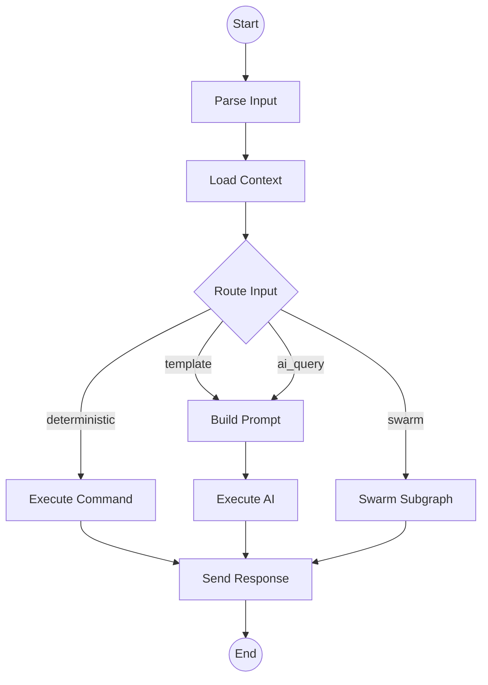
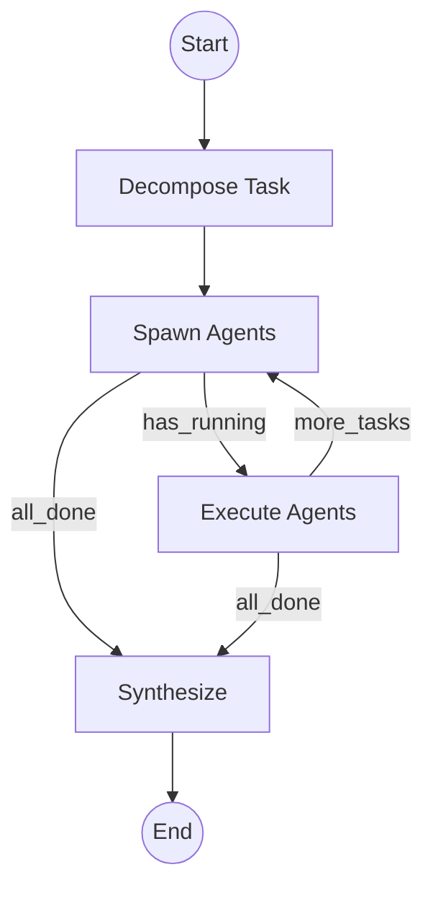

# Lugh LangGraph Service

A Python LangGraph-based orchestration service for AI workflow automation. Integrates with the main TypeScript Lugh platform via Redis pub/sub and HTTP.

## Architecture

```
┌─────────────────────────────────────────────────────────┐
│  TypeScript (Bun) - Main Lugh App                       │
│  ├── Platform Adapters (Telegram, Slack, GitHub)        │
│  ├── Command Handler (deterministic commands)           │
│  └── Orchestrator → calls LangGraph service             │
└────────────────────────┬────────────────────────────────┘
                         │ HTTP / Redis pub/sub
                         ▼
┌─────────────────────────────────────────────────────────┐
│  Python LangGraph Service (this)                        │
│  ├── FastAPI endpoints                                  │
│  ├── Conversation Graph (parse → route → execute)       │
│  ├── Swarm Subgraph (decompose → spawn → synthesize)    │
│  └── PostgreSQL Checkpointer (state persistence)        │
└─────────────────────────────────────────────────────────┘
```

## Graph Structure

### Conversation Graph



### Swarm Subgraph



## Quick Start

### Prerequisites

- Python 3.11+
- PostgreSQL
- Redis (optional, for pub/sub)

### Installation

```bash
# Create virtual environment
python -m venv .venv
source .venv/bin/activate  # or `.venv\Scripts\activate` on Windows

# Install dependencies
pip install -e ".[dev]"

# Copy environment config
cp .env.example .env
# Edit .env with your API keys
```

### Run Development Server

```bash
# Start PostgreSQL and Redis (if using Docker)
docker-compose up -d postgres redis

# Run the service
uvicorn app.main:app --reload --port 8000
```

### Run with Docker

```bash
# Build and start all services
docker-compose up -d

# View logs
docker-compose logs -f langgraph
```

## API Endpoints

### Process Conversation

```bash
POST /conversation
{
  "conversation_id": "telegram-123",
  "platform_type": "telegram",
  "message": "/help",
  "thread_id": "optional-for-resume"
}
```

### Stream Conversation (SSE)

```bash
POST /conversation/stream
# Returns Server-Sent Events with real-time updates
```

### Execute Swarm

```bash
POST /swarm
{
  "conversation_id": "telegram-123",
  "request": "Build a REST API with authentication",
  "cwd": "/home/user/project"
}
```

### Get Thread History

```bash
GET /thread/{thread_id}/history
# Returns checkpoint history for time-travel debugging
```

### Get Thread State

```bash
GET /thread/{thread_id}/state
# Returns current state for resuming conversations
```

### List Graphs

```bash
GET /graphs
# Returns graph info with Mermaid visualizations
```

## Integration with TypeScript

The main Lugh application includes a full TypeScript client for the LangGraph service.

### TypeScript Client

Located at `src/clients/langgraph.ts`:

```typescript
import { getLangGraphClient, isLangGraphEnabled } from './clients/langgraph';

// Check if LangGraph is enabled
if (isLangGraphEnabled()) {
  const client = getLangGraphClient();

  // Health check
  const healthy = await client.healthCheck();

  // Process conversation
  const response = await client.processConversation({
    conversationId: 'telegram-123',
    platformType: 'telegram',
    message: '/help',
  });

  console.log(response.responses);
}
```

### Orchestrator Adapter

Located at `src/orchestrator/langgraph-adapter.ts`:

```typescript
import { processWithLangGraph, executeSwarmWithLangGraph } from './orchestrator/langgraph-adapter';

// Process a conversation through LangGraph
const result = await processWithLangGraph(platform, conversationId, message, {
  platformType: 'telegram',
  cwd: '/home/user/project',
});

// Execute a swarm for complex tasks
const swarmResult = await executeSwarmWithLangGraph(
  platform,
  conversationId,
  'Build a REST API with authentication',
  '/home/user/project'
);
```

### Three Communication Modes

#### 1. HTTP (Synchronous)

```typescript
// Simple request/response
const response = await client.processConversation(request);
```

#### 2. Redis Pub/Sub (Async with real-time events)

```typescript
// Subscribe to events
const unsubscribe = await client.subscribe(conversationId, (event) => {
  if (event.type === 'ai_chunk') {
    console.log(event.data.content);
  }
});

// Publish request
await client.publishRequest(request);

// Later, unsubscribe
await unsubscribe();
```

#### 3. SSE Streaming

```typescript
// Stream responses as they arrive
for await (const event of client.streamConversation(request)) {
  console.log(event.type, event.data);
}
```

### Environment Variables

```bash
# Enable LangGraph integration
LANGGRAPH_ENABLED=true

# LangGraph service URL
LANGGRAPH_URL=http://localhost:8000

# Redis for pub/sub
REDIS_URL=redis://localhost:6379

# Channel prefix (must match Python service)
LANGGRAPH_CHANNEL_PREFIX=lugh:langgraph:
```

## Features

### Checkpointing

All conversation state is persisted to PostgreSQL via LangGraph's checkpointer:

- **Resume conversations**: Pick up where you left off
- **Time-travel debugging**: Inspect any previous state
- **Conversation history**: Full audit trail

### Swarm Execution

Complex tasks are automatically decomposed into parallel sub-tasks:

- **Task decomposition**: LLM-based task breakdown
- **Dependency tracking**: Respect task dependencies
- **Parallel execution**: Run independent tasks simultaneously
- **Result synthesis**: Combine agent outputs

### Streaming

Real-time updates via Server-Sent Events:

- Phase changes
- Tool calls
- AI responses
- Progress updates

## Development

### Run Python Tests

```bash
# All tests
pytest

# With coverage
pytest --cov=app

# Specific test file
pytest tests/test_graph.py
pytest tests/test_api.py

# Verbose mode
pytest -v
```

### Run TypeScript Tests

From the main project root:

```bash
# Run LangGraph client tests
bun test src/clients/langgraph.test.ts

# Run all tests
bun test
```

### Type Checking

```bash
# Python
mypy app

# TypeScript (from project root)
bun run type-check
```

### Linting

```bash
# Python
ruff check app
ruff format app

# TypeScript (from project root)
bun run lint
```

## Project Structure

```
langgraph-service/
├── app/
│   ├── __init__.py
│   ├── config.py             # Environment configuration
│   ├── main.py               # FastAPI application
│   ├── graph/
│   │   ├── __init__.py
│   │   ├── state.py          # State definitions (Pydantic models)
│   │   └── builder.py        # Graph construction
│   ├── nodes/
│   │   ├── __init__.py
│   │   ├── input_nodes.py    # Parse, classify input
│   │   ├── routing.py        # Route decisions
│   │   ├── execution_nodes.py # Execute commands/AI with LLM
│   │   └── swarm_nodes.py    # Multi-agent execution
│   ├── services/
│   │   ├── __init__.py
│   │   └── redis_pubsub.py   # Redis pub/sub for TypeScript integration
│   └── checkpointer/
│       ├── __init__.py
│       └── postgres.py       # PostgreSQL checkpointer
├── tests/
│   ├── __init__.py
│   ├── test_graph.py         # State, routing, graph tests
│   └── test_api.py           # FastAPI endpoint tests
├── Dockerfile
├── docker-compose.yml
├── pyproject.toml
└── README.md
```

### TypeScript Integration (in main project)

```
src/
├── clients/
│   ├── langgraph.ts          # LangGraph client (HTTP, Redis, SSE)
│   └── langgraph.test.ts     # Client tests
└── orchestrator/
    └── langgraph-adapter.ts  # Adapter for orchestrator integration
```

## License

MIT
