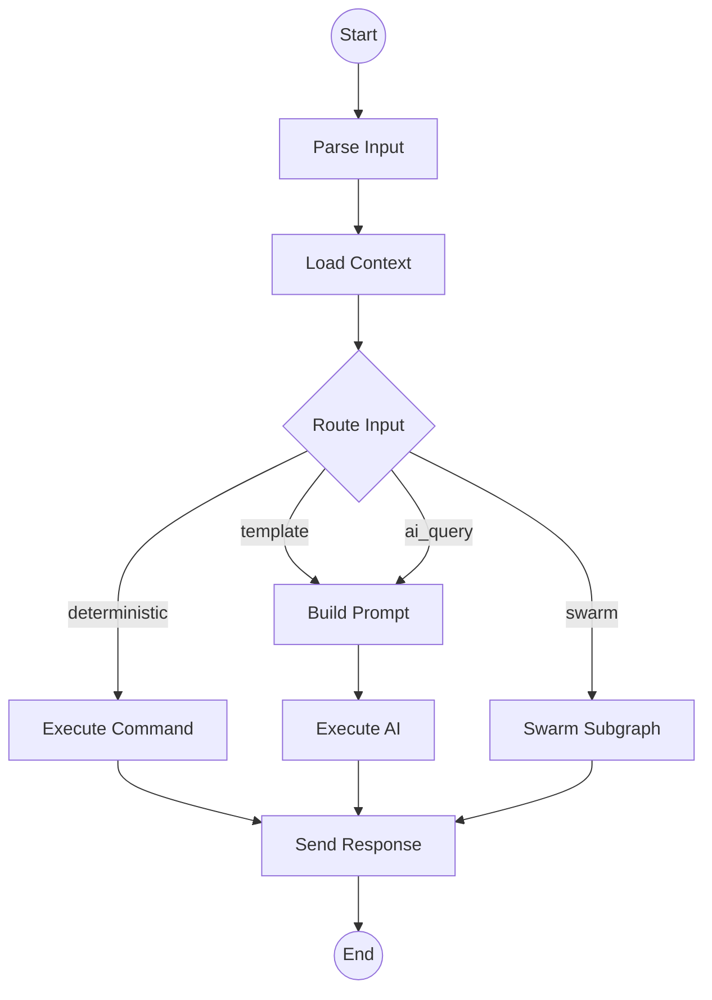
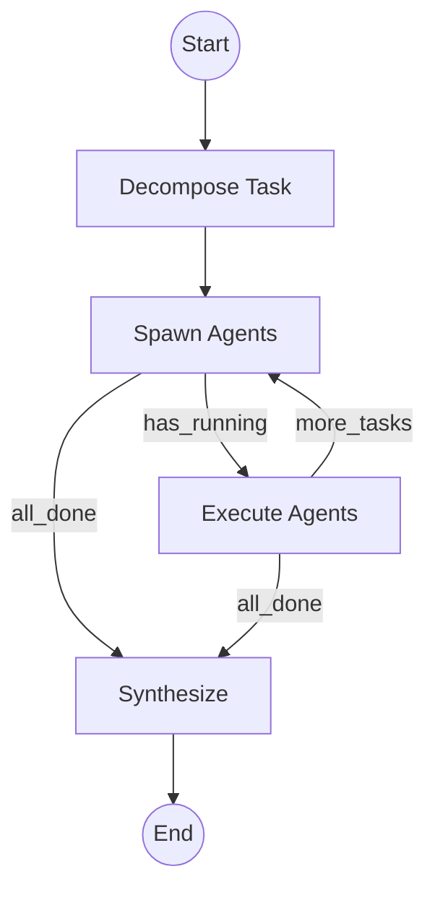

# Lugh LangGraph Service

A Python LangGraph-based orchestration service for AI workflow automation. Integrates with the main TypeScript Lugh platform via Redis pub/sub and HTTP.

## Architecture

```
┌─────────────────────────────────────────────────────────┐
│  TypeScript (Bun) - Main Lugh App                       │
│  ├── Platform Adapters (Telegram, Slack, GitHub)        │
│  ├── Command Handler (deterministic commands)           │
│  └── Orchestrator → calls LangGraph service             │
└────────────────────────┬────────────────────────────────┘
                         │ HTTP / Redis pub/sub
                         ▼
┌─────────────────────────────────────────────────────────┐
│  Python LangGraph Service (this)                        │
│  ├── FastAPI endpoints                                  │
│  ├── Conversation Graph (parse → route → execute)       │
│  ├── Swarm Subgraph (decompose → spawn → synthesize)    │
│  └── PostgreSQL Checkpointer (state persistence)        │
└─────────────────────────────────────────────────────────┘
```

## Graph Structure

### Conversation Graph



### Swarm Subgraph



## Quick Start

### Prerequisites

- Python 3.11+
- PostgreSQL
- Redis (optional, for pub/sub)

### Installation

```bash
# Create virtual environment
python -m venv .venv
source .venv/bin/activate  # or `.venv\Scripts\activate` on Windows

# Install dependencies
pip install -e ".[dev]"

# Copy environment config
cp .env.example .env
# Edit .env with your API keys
```

### Run Development Server

```bash
# Start PostgreSQL and Redis (if using Docker)
docker-compose up -d postgres redis

# Run the service
uvicorn app.main:app --reload --port 8000
```

### Run with Docker

```bash
# Build and start all services
docker-compose up -d

# View logs
docker-compose logs -f langgraph
```

## API Endpoints

### Process Conversation

```bash
POST /conversation
{
  "conversation_id": "telegram-123",
  "platform_type": "telegram",
  "message": "/help",
  "thread_id": "optional-for-resume"
}
```

### Stream Conversation (SSE)

```bash
POST /conversation/stream
# Returns Server-Sent Events with real-time updates
```

### Execute Swarm

```bash
POST /swarm
{
  "conversation_id": "telegram-123",
  "request": "Build a REST API with authentication",
  "cwd": "/home/user/project"
}
```

### Get Thread History

```bash
GET /thread/{thread_id}/history
# Returns checkpoint history for time-travel debugging
```

### Get Thread State

```bash
GET /thread/{thread_id}/state
# Returns current state for resuming conversations
```

### List Graphs

```bash
GET /graphs
# Returns graph info with Mermaid visualizations
```

## Integration with TypeScript

### Option 1: HTTP Calls

```typescript
// In your TypeScript orchestrator
const response = await fetch('http://localhost:8000/conversation', {
  method: 'POST',
  headers: { 'Content-Type': 'application/json' },
  body: JSON.stringify({
    conversation_id: conversationId,
    platform_type: platform.getPlatformType(),
    message: userMessage,
  }),
});

const result = await response.json();
for (const message of result.responses) {
  await platform.sendMessage(conversationId, message);
}
```

### Option 2: Redis Pub/Sub

```typescript
// TypeScript publishes request
await redis.publish('lugh:langgraph:request', JSON.stringify({
  conversation_id: conversationId,
  message: userMessage,
}));

// Subscribe to responses
redis.subscribe('lugh:langgraph:response:' + conversationId, (message) => {
  platform.sendMessage(conversationId, message);
});
```

## Features

### Checkpointing

All conversation state is persisted to PostgreSQL via LangGraph's checkpointer:

- **Resume conversations**: Pick up where you left off
- **Time-travel debugging**: Inspect any previous state
- **Conversation history**: Full audit trail

### Swarm Execution

Complex tasks are automatically decomposed into parallel sub-tasks:

- **Task decomposition**: LLM-based task breakdown
- **Dependency tracking**: Respect task dependencies
- **Parallel execution**: Run independent tasks simultaneously
- **Result synthesis**: Combine agent outputs

### Streaming

Real-time updates via Server-Sent Events:

- Phase changes
- Tool calls
- AI responses
- Progress updates

## Development

### Run Tests

```bash
pytest
pytest --cov=app  # with coverage
```

### Type Checking

```bash
mypy app
```

### Linting

```bash
ruff check app
ruff format app
```

## Project Structure

```
langgraph-service/
├── app/
│   ├── __init__.py
│   ├── config.py           # Environment configuration
│   ├── main.py             # FastAPI application
│   ├── graph/
│   │   ├── __init__.py
│   │   ├── state.py        # State definitions
│   │   └── builder.py      # Graph construction
│   ├── nodes/
│   │   ├── __init__.py
│   │   ├── input_nodes.py  # Parse, classify input
│   │   ├── routing_nodes.py # Route decisions
│   │   ├── execution_nodes.py # Execute commands/AI
│   │   └── swarm_nodes.py  # Multi-agent execution
│   └── checkpointer/
│       ├── __init__.py
│       └── postgres.py     # PostgreSQL checkpointer
├── tests/
├── Dockerfile
├── docker-compose.yml
├── pyproject.toml
└── README.md
```

## License

MIT
